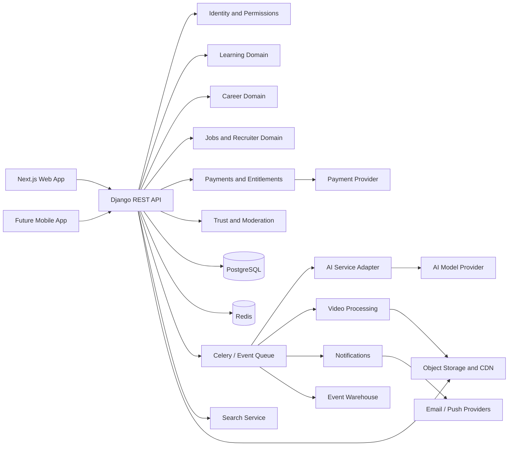

# T-Career CTO Architecture Review

Date: 2026-07-02

## Executive Verdict

T-Career has the right broad ambition: combine learning, career preparation, portfolio proof, job discovery, recruiter access, certificates, payments, and AI guidance. The current project is not yet an enterprise-ready platform. It is a promising Django modular monolith with several MVP domains present, but it still has product gaps, security inconsistencies, incomplete frontend source, weak revenue prioritization, and missing operational controls.

The best path is not to jump to microservices. Keep a modular monolith through MVP and early traction, but enforce clean domain boundaries, events, observability, permissions, and data ownership now so the platform can later extract hot domains such as AI tutor, search, video processing, and recruiter matching.

## Evidence Reviewed

- Uploaded request text and prior CTO analysis conversation.
- Project archive `D:\tcareer.zip`, extracted into this workspace.
- Backend Django apps under `backend/apps`.
- Core settings, URL routing, Docker Compose, models, serializers, and API views.
- Available project text files and dependency files.

No PDF, DOCX, spreadsheet, or markdown business documents were present in the extracted archive. The only document-style files found were dependency text files and scratch/build text files.

## Current Architecture Snapshot

The backend is a Django REST Framework modular monolith with PostgreSQL, Redis, Celery, JWT authentication, Stripe placeholders, AWS media/storage placeholders, OpenAI integration placeholders, and domain apps for:

- Users and authentication
- Courses and lessons
- Assessments
- Certificates
- AI tutor
- Jobs
- Payments
- Career tracks
- Community
- Notifications
- Careers, portfolios, and resumes
- Geography/localization
- Profiles
- Verification and trust

The frontend directory contains `.next`, `node_modules`, config files, and generated fix scripts, but it does not currently show a clean committed `app`, `src`, `package.json`, or reusable component tree in the extracted workspace. That is a major delivery risk because the product UI cannot be reliably rebuilt, reviewed, or maintained from source as extracted.

## Critical Findings

### 1. Authentication Design Is Inconsistent

The code comments say refresh tokens should be stored in httpOnly cookies, but registration and login return refresh tokens in the response body. That encourages frontend storage in localStorage or other JavaScript-readable state, increasing XSS blast radius.

Recommendation:

- Store refresh tokens in `HttpOnly`, `Secure`, `SameSite=Lax` or `Strict` cookies.
- Return only access tokens and user profile data to JavaScript.
- Add CSRF protection for cookie-auth refresh/logout endpoints.
- Track refresh token family/device records for revocation and anomaly detection.

### 2. Role Model Is Too Small

Current roles are student, instructor, recruiter, and admin. The business needs more actor types:

- Student
- Instructor
- Mentor
- Recruiter
- Company admin
- University admin
- Enterprise learner manager
- Content moderator
- Finance/admin operations
- Platform super admin

Recommendation:

- Keep a primary user role for simple flows.
- Add organization membership with scoped roles.
- Add a permission matrix before building more endpoints.
- Use object-level authorization consistently for courses, jobs, portfolios, verification records, invoices, and private documents.

### 3. Frontend Source Is Not in a Healthy State

The extracted frontend includes `.next` and `node_modules`, but not the normal source tree needed for maintainable Next.js development. This suggests the archive contains build artifacts or an incomplete copy.

Recommendation:

- Reconstruct or restore the source tree.
- Commit `package.json`, lockfile, `app` or `src`, components, lib, hooks, stores, and tests.
- Remove generated build output and dependencies from source control.
- Add CI build checks so this never ships again.

### 4. MediaConvert Webhook Exposure

There is an unauthenticated `mediaconvert_webhook` endpoint and a second `mediaconvert_webhook_v2` with optional secret validation. If the secret is unset, the v2 endpoint also accepts events.

Recommendation:

- Remove or disable the original unauthenticated webhook.
- Require a secret or AWS EventBridge/SNS signature verification in every environment.
- Validate job ownership with metadata, not only `jobId`.
- Make webhook processing idempotent.

### 5. AI Tutor Needs Cost and Safety Controls

The AI tutor models store conversations and token counts, but the architecture needs stronger runtime protection.

Recommendation:

- Enforce per-user, per-course, and per-plan token budgets.
- Use async AI jobs for long-running tasks and streaming for chat.
- Add prompt injection defenses, output filtering, and model fallback policies.
- Store only necessary conversation context and define retention controls.
- Add observability for cost per feature, user, course, and cohort.

### 6. Course Content Needs Moderation and Sanitization

Courses, lessons, reviews, discussions, replies, portfolios, and resumes all contain user-generated content. There is no complete moderation pipeline visible.

Recommendation:

- Sanitize rich text server-side and client-side.
- Add content status fields: draft, pending_review, approved, rejected, suspended.
- Add reporting, reviewer queues, audit logs, and appeal workflows.
- Add automated checks for spam, toxic content, malware, and policy violations.

### 7. Payments Are Too Narrow

The payment model assumes one MVP subscription plan. That may work for a test, but it does not match the likely revenue architecture.

Recommendation:

- Add product catalog support for subscriptions, cohorts, course purchases, certificate fees, recruiter seats, enterprise contracts, and university licenses.
- Add invoices, entitlements, coupons, trials, refunds, tax/VAT metadata, and webhooks.
- Treat entitlement checks as a first-class service, not scattered payment logic.

### 8. Search Is Not Yet a Platform Capability

The code has a search app route, but the platform needs search across courses, jobs, profiles, portfolios, companies, instructors, discussions, and skills.

Recommendation:

- Use PostgreSQL full-text search for MVP only if volume is low.
- Move to Typesense, Meilisearch, or OpenSearch once course/job/profile volume grows.
- Add event-driven indexing for course publish, job publish, portfolio update, certificate issue, and profile visibility changes.

### 9. Certificate Integrity Needs Stronger Trust

Certificates exist with public numbers and revocation, which is a good base. The system still needs stronger proof.

Recommendation:

- Sign certificate payloads server-side.
- Expose a public verification endpoint that does not require login.
- Include certificate status, recipient, course, issue date, issuer, and revocation state.
- Add anti-cheat signals and assessment proctoring options for premium certificates.

### 10. Localization Strategy Is Unclear

Several defaults point to Guinea, French, GNF, and Africa/Conakry. That may be intentional, but it conflicts with a global platform narrative unless the first market is explicitly Guinea or Francophone West Africa.

Recommendation:

- Decide the initial wedge market.
- If Guinea/Francophone Africa is the wedge, make that explicit in product, pricing, language, jobs, and partnerships.
- If global is the goal from day one, remove country-specific defaults from user creation and infer locale from request, browser, or onboarding.

## Missing Product Requirements

- Organization model for universities, employers, bootcamps, and enterprise customers.
- Instructor onboarding, verification, payout, tax, and revenue share policies.
- Recruiter subscription tiers, seats, team accounts, candidate unlocks, and messaging limits.
- University admin console with cohorts, placement dashboards, and reports.
- Mentor marketplace, scheduling, availability, reviews, and no-show policy.
- Course content review and publishing workflow.
- Full permission matrix across all roles and object types.
- Accessibility requirements tied to WCAG 2.2 AA.
- Data privacy, consent, retention, deletion, export, and audit requirements.
- AI data usage policy and user-facing consent.
- Offline or low-bandwidth learning mode.
- Notification preferences and unsubscribe controls.
- Fraud controls for payments, certificates, reviews, jobs, and recruiter access.
- Incident response and abuse handling process.

## Missing Business Opportunities

1. University SaaS

Sell T-Career to universities as a career-readiness and placement platform with cohorts, admin dashboards, custom tracks, and graduate outcome reporting.

2. Recruiter Seats

Charge employers monthly for recruiter seats, candidate search, profile unlocks, AI-ranked shortlists, job boosts, and messaging.

3. Enterprise Upskilling

Sell annual licenses to companies for employee learning paths, completion reporting, internal skill mapping, and certificates.

4. Verified Hiring Challenges

Let employers sponsor skill challenges. Students earn employer-backed badges. Employers pay for challenge hosting and candidate access.

5. Instructor Marketplace

Create a revenue share model with verified instructors, paid cohorts, live workshops, and premium courses.

6. Career API

Package resume parsing, skill extraction, candidate matching, and job-fit scoring as APIs for partners after the platform proves demand.

## Target Enterprise Architecture

### MVP to 50,000 Users

Keep the modular Django monolith.

Core stack:

- Django REST Framework
- PostgreSQL
- Redis
- Celery
- S3-compatible object storage
- CDN for static/media
- Next.js frontend
- Stripe or regional payment provider
- OpenAI or multi-provider AI adapter
- Basic observability with structured logs, Sentry, metrics, and uptime checks

Rules:

- Every domain has models, serializers, services, views, permissions, and tests.
- Views stay thin. Business logic lives in services.
- Cross-domain side effects emit events, even if the first implementation uses Celery tasks.
- All external webhooks are authenticated and idempotent.
- Entitlements are checked centrally.

### 50,000 to 250,000 Users

Add scale controls without splitting everything:

- PgBouncer for database connection pooling.
- Read replicas for analytics/reporting queries.
- Dedicated search service.
- CDN-backed HLS video delivery with signed URLs.
- Background AI queues with priority by plan.
- Rate limits by endpoint and plan.
- Feature flags.
- Audit logging for admin, verification, payments, and trust events.
- Data warehouse pipeline for product analytics.

### 250,000 to 1 Million Users

Extract only domains with independent scaling pressure:

- AI service for tutor, resume analysis, recommendations, and evaluations.
- Search and matching service.
- Media processing service.
- Notifications service.
- Analytics/event ingestion service.

Keep identity, entitlements, courses, jobs, and certificates strongly consistent until there is a proven need to split them.

## Recommended Domain Boundaries

- Identity: users, auth, sessions, MFA, organization memberships.
- Learning: courses, lessons, enrollments, progress, reviews.
- Assessment: quizzes, submissions, grading, anti-cheat signals.
- Credentials: certificates, badges, public verification, revocation.
- Career: resumes, portfolios, skills, career tracks, recommendations.
- Jobs: companies, job posts, applications, candidate pipeline.
- Recruiter: seats, candidate search, unlocks, messaging, team billing.
- AI: tutor, resume analysis, skill gap analysis, job matching.
- Payments: plans, subscriptions, invoices, transactions, refunds, entitlements.
- Trust: identity verification, content moderation, abuse reports, audits.
- Notifications: email, in-app, push, preferences.
- Analytics: events, dashboards, business metrics, learning outcomes.

## Revenue Priority

Build in this order:

1. University and enterprise admin capabilities.
2. Recruiter seats and candidate search.
3. Learner subscriptions and premium AI credits.
4. Certificate fees and verified badges.
5. Instructor marketplace and paid cohorts.
6. Partner APIs.

The current product seems learner-first. That is good for mission, but not enough for startup-grade revenue. The platform should be learner-loved and institution-funded.

## Security Roadmap

Immediate:

- Move refresh tokens to httpOnly cookies.
- Remove unauthenticated webhooks.
- Add object-level permission tests.
- Sanitize all user-generated HTML.
- Add file validation and malware scanning for uploads.
- Remove secrets from shared chats and rotate any exposed passwords.

Next:

- Add MFA for admins, instructors, recruiters, and university/company admins.
- Add organization-scoped permissions.
- Add audit logs for privileged access.
- Add admin IP/device/session visibility.
- Add security headers and strict CORS/CSRF policy.
- Add dependency and container scanning in CI.

Later:

- SOC 2-style controls.
- Data retention automation.
- DPA support for B2B contracts.
- Regional data residency if university or government contracts require it.

## Technical Roadmap

### Sprint 1: Stabilize the Repo

- Restore frontend source and remove build artifacts.
- Add `.gitignore` coverage for `.next`, `node_modules`, caches, local DBs, and generated scratch scripts.
- Run backend tests and fix failing suites.
- Add CI for backend tests, linting, frontend build, and type checks.

### Sprint 2: Security Foundation

- Cookie-based refresh flow.
- Object-level permission coverage.
- Webhook authentication.
- Upload validation and scanning hooks.
- Role and permission matrix.

### Sprint 3: Monetizable MVP

- Entitlement service.
- Stripe webhooks.
- Subscription plans.
- Recruiter waitlist to paid recruiter seats.
- Company profile and job posting ownership.

### Sprint 4: Learning Quality

- Course publish workflow.
- Video signed URL delivery.
- Assessment completion rules.
- Certificate verification.
- Content moderation queues.

### Sprint 5: AI Differentiation

- AI tutor streaming.
- AI budget enforcement.
- Resume and portfolio analysis.
- Skill gap recommendations.
- Job-fit scoring with explainability.

### Sprint 6: B2B Platform

- Organizations.
- University cohorts.
- Employer teams.
- Admin dashboards.
- Outcome reports.
- Data export.

## Architecture Diagram

## Final CTO Recommendation

Do not rebuild from scratch. The backend foundation is useful. But before adding more features, turn this into a disciplined product platform:

- Restore and clean the frontend source.
- Fix authentication, webhook, and permission risks.
- Define organizations and entitlements.
- Prioritize B2B and recruiter revenue.
- Treat AI as a governed platform capability, not scattered endpoint logic.
- Keep the monolith, but enforce boundaries as if extraction will happen later.

The goal for the next phase should be a secure, demoable, monetizable platform that proves one wedge market deeply. A broad feature checklist will not win. A trusted career outcomes platform with clear revenue loops can.
